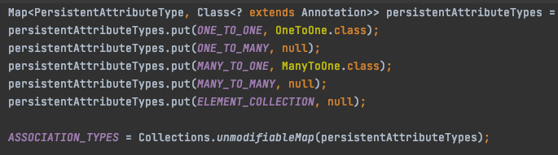
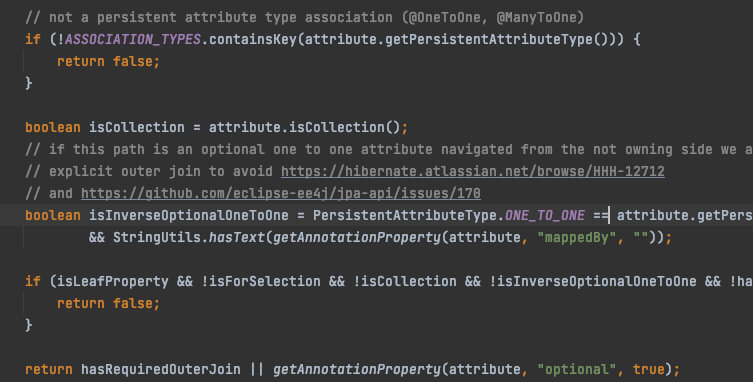
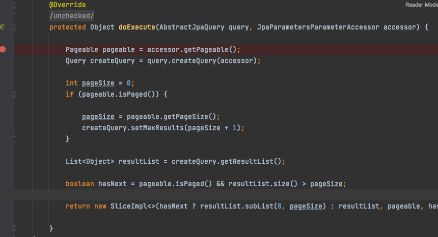

## Spring Data Jpa Repositories 팁

(1) Join 명시하기  
아래와 같이 _를 이용하여 Entity의 그래프를 탐색하여 Join 을 명시 할 수 있다.

```kotlin
interface UserRepository: JpaRepository<User, Long> {
    fun findAllByUserRoles_Role_Id(roleId: String): List<User>
}
```

실행 결과.

```sql
select user0_.user_key  as user_key1_1_,
       user0_.id        as id2_1_,
       user0_.joined_at as joined_a3_1_,
       user0_.user_name as user_nam4_1_
from usr_user user0_
         left outer join
     usr_user_role userroles1_ on user0_.user_key = userroles1_.user_key
         left outer join
     mst_role role2_ on userroles1_.role_key = role2_.role_key
where role2_.id = ?
```

단 User에서 One To Many인 userRoles로 접근하기에 left outer join으로 나간다.  
아래의 메서드에서 Outer Join이 필요한 지 결정이 되는데

```java
/**
 * @see org.springframework.data.jpa.repository.query.QueryUtils#requiresOuterJoin
 */
```

OneToMany의 경우 ASSOCIATION_TYPES에 매핑된 값도 없고   
  

그 외 조건문에도 안걸려서 결국 리턴문에 있는 getAnnotationProperty(attribute, "optional", true); 메서드에 의해서 결정 된다.  
이때 OneToMany에 optional 속성이 없으므로 default인 true가 반환되어 left outer join으로..


inner join이 필요하면 직접 jpql을 구현하는게 나을지도..
```kotlin
val resultList = em.createQuery(
    """
    select u from User u
    join u.userRoles ur
    join ur.role r
    where r.id =:id
""".trimIndent()
).setParameter("id", "ADMIN").resultList
```

아래와 같이 UserRole에서 시작하는 그래프는 문제 없다.  
optional=false 이므로 inner join이 나간다.
```kotlin
interface UserRoleRepository: JpaRepository<UserRole, Long> {
    fun findAllByRoleId(roleId: String): List<UserRole>
}
```
```sql
 select
    userrole0_.user_role_key as user_rol1_2_,
    userrole0_.role_key as role_key2_2_,
    userrole0_.user_key as user_key3_2_ 
from
    usr_user_role userrole0_ 
inner join
    mst_role role1_ 
        on userrole0_.role_key=role1_.role_key 
where
    role1_.id=?
```

(2) Slice  
Slice 리턴타입을 허용한다.  
```kotlin
interface UserRepository: JpaRepository<User, Long> {
    fun findAllByIdLike(id: String, pageable: Pageable): Slice<User>
}
```  
Page가 리턴타입인 경우 추가적으로 count 쿼리가 나간다.  
하지만 Slice 타입인 경우 count 쿼리 없이 조회 한다.  

nextOrLastPageable 메서드를 통해 다음 페이지에 대한 Pageable 객체를 생성 해 올 수 있다.  
```kotlin
@Test
fun queryTestSliceFetchAll() {
    (1..1000).map {
        UserCreateRequest(
            id = "taesu$it",
            name = "Lee TAeSu",
            roleKeys = emptySet()
        )
    }.toList()
        .apply {
            userCreateService.create(this)
        }

    val result = mutableSetOf<User>()
    var fetch = userRepository.findAllByIdLike("taesu%", Pageable.ofSize(10))
    while (!fetch.isLast) {
        result.addAll(fetch.content)
        fetch = userRepository.findAllByIdLike("taesu%", fetch.nextOrLastPageable())
    }
    if (fetch.hasContent()) {
        result.addAll(fetch.content)
    }

    assertThat(result.size).isEqualTo(1000)
}
```

hasNext 여부는 어떻게 알까?  
아래와 같이 요청한 pageSize에 +1을 더해서 결과를 하나 더 가져온다.  


10개를 요청하면 11개를 조회하고 조회된 개수가 10보다 크면 hasNext가 있다고 판정한다.  


(3) DTO Projection  
아래와 같이 DtoProject을 리턴타입으로도 받을 수 있다.  
```kotlin
class UserKeyIdDto(
    val key: Long,
    val id: String
)

interface UserRepository: JpaRepository<User, Long> {
    fun findUserKeyIdDtoByUserRolesRoleId(roleId: String): List<UserKeyIdDto>
}
```
실제 쿼리에서도 두 개의 필드만 가져온다.  
```sql
select
    user0_.user_key as col_0_0_,
    user0_.id as col_1_0_ 
from
    usr_user user0_ 
left outer join
    usr_user_role userroles1_ 
        on user0_.user_key=userroles1_.user_key 
left outer join
    mst_role role2_ 
        on userroles1_.role_key=role2_.role_key 
where
    role2_.id=?

```
아래와 같이 DtoProjection 타입을 정의해도 가능하다.  
```kotlin
interface UserRepository: JpaRepository<User, Long> { 
    fun <T> findAnyByUserRolesRoleId(roleId: String, type: Class<T>): List<T>
}

val findAnyByUserRolesRoleId = userRepository.findAnyByUserRolesRoleId("ADMIN", UserKeyIdDto::class.java)
```