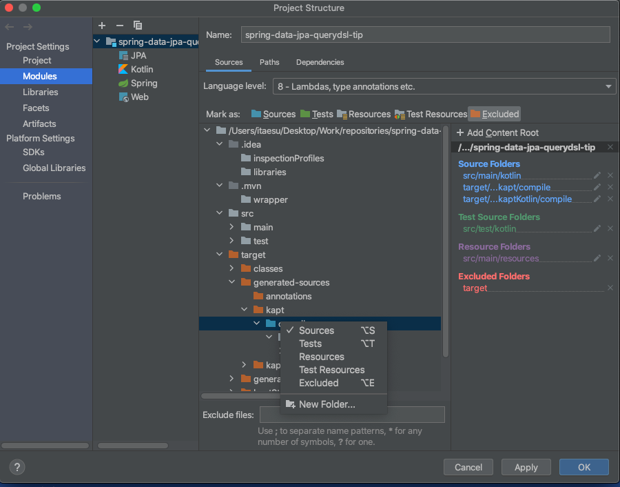
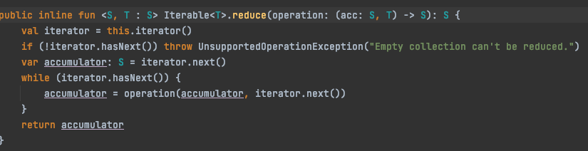
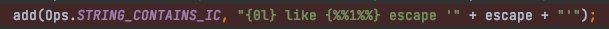
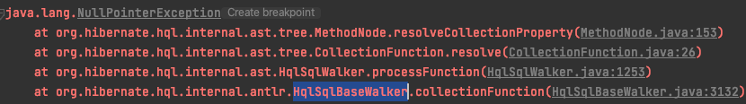

# Spring Data Jpa 환경에서 QueryDSL을 사용할 때 Tip

### (1) IntelliJ에서 QClass가 인식되지 않는 경우  

언제서부터인가 IntelliJ에서 QueryDSL 전용 QClass를 못찾는 현상이 발생했다.  
아니면 원래 Kotlin - QueryDSL 환경은 다른지도 모르겠다. Java - QueryDSL에선 이런 설정을 한 기억이 없는 것 같다.   
이럴 땐 아래와 같이 컴파일 된 QClass가 존재하는 디렉터리를 Source Folders로 지정해주면 된다.  


### (2) 검색 조건에 따라서 동적인 Boolean Expression 만들기  
아래와 같은 검색 필터가 있는 경우 보통 각 프로퍼티가 null이 아닌지 조사해서 and로 연결한다.
```kotlin
class IssuePaginateCriteria(
    page: Int,
    size: Int,
    val id: String? = null,     // equals
    val name: String? = null,   // like
    val status: String? = null, // like
    val description: String? = null,    // like
): PageableCriteria(page, size)
```

```kotlin
var expression = Expressions.asBoolean(true).isTrue // 혹은 null로
if (criteria.id != null) {
    expression = expression.and(iu.id.eq(criteria.id))
}
if (criteria.name != null) {
    expression = expression.and(iu.name.contains(criteria.name))
}
if (criteria.status != null) {
    expression = expression.and(iu.status.contains(criteria.status))
}
if (criteria.description != null) {
    expression = expression.and(iu.description.contains(criteria.description))
}
```

이때 Kotlin의 let을 활용하면 코드가 좀 더 간결해진다.  
```kotlin
internal fun getPredicates(
    criteria: IssuePaginateCriteria,
    iu: QIssue,
): List<BooleanExpression> {
    return listOfNotNull(
        criteria.id?.let { iu.id.eq(it) },
        criteria.name?.let { iu.name.containsIgnoreCase(it) },
        criteria.status?.let { iu.status.likeIgnoreCase("%$it%") },
        criteria.description?.let { iu.description.likeIgnoreCase(it.likeEscape(), '\\') },
    )
}
```

listOfNotNull 함수를 사용해서 제외할 조건이 걸러진 리스트에 reduce 연산을 수행해주면 된다.  
```kotlin
val predicate = getPredicates(criteria, iu).reduce { acc, expression -> acc.and(expression) }
```
여기서 주의해야 하는 것이 빈 리스트에 reduce를 수행할 경우 예외가 떨어진다는 점. 


보통은 driven key가 있어서 list가 비어있을 경우가 없긴 한데 비어있는 경우의 수가 있다면  
반드시 별도의 처리를 해줘야 한다. 아래는 true is true로 방어코드를 넣은 처리이다.  
```kotlin
internal fun getPredicates(
    criteria: IssuePaginateCriteria,
    iu: QIssue,
): List<BooleanExpression> {
    return listOfNotNull(
        Expressions.asBoolean(true).isTrue,
        criteria.id?.let { iu.id.eq(it) },
        criteria.name?.let { iu.name.containsIgnoreCase(it) },
        criteria.status?.let { iu.status.likeIgnoreCase("%$it%") },
        criteria.description?.let { iu.description.likeIgnoreCase(it.likeEscape(), '\\') },
    )
}
```

아니면 reduce 쪽에서 방어코드를 넣어줘도 좋다.  
QueryDSL은 predicate가 null인 것도 허용 한다.  
```kotlin
 val predicate =
            getPredicates(criteria, iu).let {
                if (it.isEmpty()) null else it.reduce { acc, expression -> acc.and(expression) }
            }

 val query = queryDsl.createQuery<IssueQueryResult>()
            .select(IssueQueryResult.projection(iu))
            .from(iu)
            .where(predicate)
            .limit(pageRequest.pageSize.toLong())
            .offset(pageRequest.offset)
            .orderBy(iu.key.desc())
```

### (3) LIKE 검색 시 contains 메서드와 like 함수의 차이점     
like는 %%를 양쪽에 알아서 붙여주지 않는다.  
반면 contains는 양쪽에 붙여준다.  

like는 _, %에 대한 escape 처리가 되어있지 않다.  
contains는 escape 처리가 되어있다.   
```kotlin
 internal fun getPredicates(
        criteria: IssuePaginateCriteria,
        iu: QIssue,
    ): List<BooleanExpression> {
        return listOfNotNull(
            criteria.id?.let { iu.id.eq(it) },
            criteria.name?.let { iu.name.containsIgnoreCase(it) },
            criteria.status?.let { iu.status.likeIgnoreCase("%$it%") },
            criteria.description?.let { iu.description.likeIgnoreCase(it.likeEscape(), '\\') },
        )
    }
```

여기서 escape는 서비스 환경에 따라 원치않는 결과를 반환할 수 있어 웬만하면 처리해주는 것이 좋다.  

아래와 같이 데이터가 있을 때

| key   | 이름    |
| ----- | ------ |
| 1     | 이름_1  |
| 2     | 이름 2  |

이런 쿼리를 날리면 두 행이 모두 나온다.  
```sql
select * from usr_user where name like '%이름_%'
```

그래서 아래와 같이 escape 문자를 지정해주는 처리가 필요하다.  
```sql
select * from usr_user where name like '%이름\_%' escape '\'
```

QueryDSL의 contains는 JPQLTemplates에 의해 아래와 같이 등록된 Operation을 사용한다.



### (4) SetPath<String> or ListPath<String> 필드에 like 조건 걸기.

아래와 같이 JSON 데이터를 Converter를 통해 관리하는 Entity가 있을 때  
```kotlin
@Entity(name = "Member")
@Table(name = "MEMBER")
class Member(
    @Id
    @Column(name = "MEMBER_KEY")
    @GeneratedValue(strategy = GenerationType.IDENTITY)
    val key: Long = 0L,

    @NaturalId
    @Column(name = "ID", length = 128, unique = true, nullable = false)
    val id: String,

    @Column(name = "NAME", length = 256, nullable = false)
    val name: String,

    @Convert(converter = StringListConverter::class)
    @Column(name = "HOBBIES", columnDefinition = "TEXT", nullable = false)
    val hobbies: Set<String>
)
```
hobbies를 대상으로 LIKE 쿼리를 날린다면 아래와 같이 contains 메서드를 쓸 수 있을 것 같이 보인다.  
```kotlin
internal fun getPredicates(
    criteria: MemberPaginateCriteria,
    mb: QMember,
): List<BooleanExpression> {
    return listOfNotNull(
        criteria.name?.let {
            mb.name.containsIgnoreCase(it)
        },
        criteria.hobby?.let {
            mb.hobbies.contains(it)
        },
    )
}
```
하지만 아래와 같이 HqlSqlBaseWalker에서 NPE가 발생한다.  
  

어찌보면 당연하다 HQL은 Converter 정보를 보고 쿼리를 빌드하는 것이 아니라 필드의 타입을 볼테니.  
이럴땐 BooleanExpression을 직접 생성해주면 된다.  
```kotlin
internal fun getPredicates(
    criteria: MemberPaginateCriteria,
    mb: QMember,
): List<BooleanExpression> {
    return listOfNotNull(
        criteria.name?.let {
            mb.name.containsIgnoreCase(it)
        },
        criteria.hobby?.let {
            Expressions.booleanTemplate("lower({0}) like concat('%', {1}, '%') escape '!'", mb.hobbies, it.lowercase())
        },
    )
}
```

여기서 확장함수로 빼내면 좀 더 보기좋은 코드가 나온다.  
```kotlin
internal fun getPredicates(
    criteria: MemberPaginateCriteria,
    mb: QMember,
): List<BooleanExpression> {
    return listOfNotNull(
        criteria.name?.let {
            mb.name.containsIgnoreCase(it)
        },
        criteria.hobby?.let {
            mb.hobbies.containsIgnoreCase(it)
        },
    )
}

private fun SetPath<String, StringPath>.containsIgnoreCase(value: String) =
    Expressions.booleanTemplate("lower({0}) like concat('%', {1}, '%') escape '!'", this, "!${value.lowercase()}")
```

List, Set 등 다양한 컬렉션을 쓸 것을 생각한다면 아래와 같이 제네릭 확장함수를 사용하면 된다. 
```kotlin
fun <T: Collection<E>, E> CollectionExpression<T, E>.containsIgnoreCase(value: String) =
    Expressions.booleanTemplate("lower({0}) like concat('%', {1}, '%') escape '!'", this, "!${value.lowercase()}")
```

당연하지만 규모가 커지면 구조적인 개선이 반드시 필요하다.